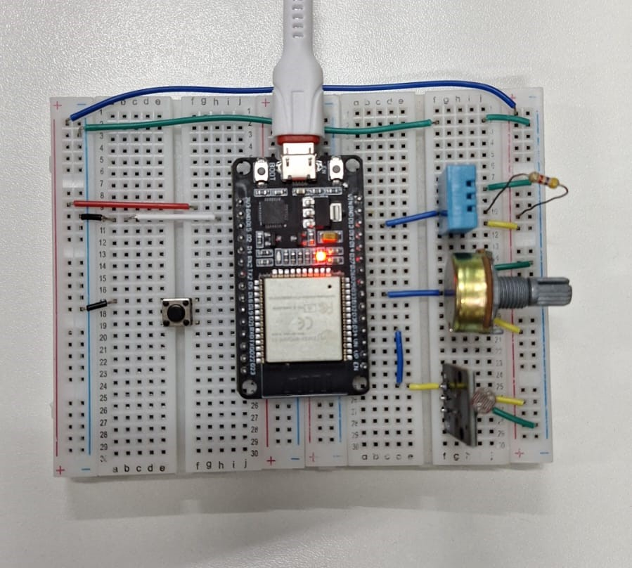

    <h1 align="center">🤖🌌 Projeto: Robô Inteligente Explorador Autônomo em Missão Planetária 🚀🪐</h1>

## Sistemas Embarcados - Problema #3 - 2025.1

Este repositório contém a solução desenvolvida para o Problema #3 da disciplina de Sistemas Embarcados da Universidade Estadual de Feira de Santana (UEFS). O projeto consiste em um robô explorador autônomo baseado no ESP32, capaz de coletar dados ambientais, processá-los com uma Rede Neural Embarcada para classificar o terreno e enviar os resultados para um centro de análise remoto, além de interagir com o usuário via WhatsApp. 

---

### 1. Visão Geral
O objetivo principal deste projeto é desenvolver um robô móvel autônomo utilizando um sistema embarcado ESP32. Este robô é projetado para simular a exploração da superfície de um planeta desconhecido, coletando dados de temperatura, umidade, gás e luz. Uma rede neural embarcada processa esses dados para classificar o ambiente como "Propício a Vida", "Condição Moderada" ou "Ambiente Hostil". Em caso de ambiente propício à vida, o robô envia uma notificação via WhatsApp com os dados coletados. 

---

### 2. Objetivos de Aprendizagem
Ao final da realização deste problema, os discentes deveriam ser capazes de: 

Aplicar conhecimentos de circuitos digitais e arquiteturas de computadores para desenvolver um Sistema Embarcado. 
* Implementar a solução em C no ESP32. 
* Entender as dificuldades tecnológicas no desenvolvimento de Sistemas Embarcados e Internet das Coisas. 
* Compreender os princípios básicos da arquitetura ESP32. 
* Utilizar Banco de Dados para Internet das Coisas (mencionado no problema, mas não totalmente implementado no código). 
* Utilizar Dashboards para Internet das Coisas (a infraestrutura de MQTT permite a integração com dashboards). 
* Utilizar as interfaces disponíveis no ESP32.

---
### 3. Requisitos Atendidos
A solução desenvolvida atende aos seguintes requisitos propostos:

#### 3.1. Linguagem de Programação
O código foi integralmente escrito em linguagem C, conforme especificado.

#### 3.2. Funcionalidades
* **Sensores**:

    * **Temperatura e Umidade:** Leitura contínua de temperatura e umidade utilizando o sensor DHT11 conectado ao pino digital 12.

    * **Gás:** Leitura contínua dos níveis de gás utilizando um potenciômetro conectado à entrada analógica (pino 2).

    * **Luz (Fotorresistor):** Leitura contínua da intensidade luminosa do ambiente por meio de um fotorresistor conectado à entrada analógica (pino 13).

* **Botão de Parada**: Um botão (pino 15) configurado com interrupção externa é utilizado. Quando acionado, ele dispara uma flag para publicação de uma mensagem via MQTT no tópico de operação, simulando um comando de controle. 

* **Monitor Serial**: Apresenta no monitor serial os dados dos sensores (temperatura, umidade, gás, luz) e o resultado da avaliação da Rede Neural a cada 0.5 segundos. 

* **Conectividade WiFi**: O robô se conecta à rede WiFi ao iniciar. Em caso de falha na conexão, mensagens de "Conectando-se ao wifi.." são exibidas.
* **Conectividade MQTT**: O robô conecta-se ao broker MQTT (`broker.emqx.io`, porta `1883`) utilizando as credenciais fornecidas (`NAlisson`, `Nathiele`). Ele publica periodicamente os dados dos sensores e o resultado da avaliação da Rede Neural nos tópicos específicos:  
    * `UEFS_TEC_470/temperatura`  
    * `UEFS_TEC_470/umidade_relativa`  
    * `UEFS_TEC_470/luz`  
    * `UEFS_TEC_470/gas`  
    * `UEFS_TEC_470/chance_vida`  
Além disso, o robô se inscreve no tópico `UEFS_TEC_470/operacao` para receber comandos remotos, permitindo interação e controle à distância.

* **Mensagem no WhatsApp**: Se a Rede Neural classificar o ambiente como "Propício a Vida" (chance de vida >80%), o robô envia uma mensagem formatada via CallMeBot API para o número de telefone configurado, contendo os dados dos sensores e a probabilidade de vida.

* **Rede Neural Embarcada**: Uma Rede Neural Artificial foi embarcada no ESP32. Ela avalia os dados dos sensores a cada 0.5 segundos e classifica o ambiente planetário nas seguintes condições: 
  * Propício a Vida: ≥80% 
  * Condição Moderada: ≥50% e <80% 
  * Ambiente Hostil: <50%  

  A rede neural foi gerada via MATLAB Coder e seus pesos e bias estão definidos em `predict_chancevida.cpp` e declarados em `predict_chancevida.h`.

* **Interrupção Externa**: O botão de parada utiliza interrupção externa para enviar uma mensagem MQTT quando pressionado, permitindo controle remoto do robô.

* **Banco de Dados**: A funcionalidade de geração de JSON para envio de dados (incluindo horário e data) está presente no código (`gerarJson()`).

* **Dashboard**: A publicação contínua dos dados dos sensores e do resultado da chance de vida via MQTT permite a integração com um Dashboard online para monitoramento. A capacidade de receber comandos remotos (`topico_operacao`) também está implementada.

#### 3.3. Requisitos Parcialmente Atendidos

* **Desligamento do sistema via botão**: O botão de parada não desliga automaticamente o sistema; ele apenas envia uma mensagem MQTT.
* **Foto**: A funcionalidade de tirar foto e encaminhar ao Dashboard em caso de ambiente propício à vida não foi implementada.
* **Dados de tempo no JSON**: Embora a função `get_time_stamp()` e `gerarJson()` existam, a chamada para `gerarJson()` está comentada na função `publicar_dados()`, e as variáveis `operacao` e `data_hora` usadas em `gerarJson()` não estão globalmente definidas no código principal.

---
### 4. Estrutura do Projeto
O projeto é composto pelos seguintes arquivos:

* `Robo_Explorador_Autonomo.ino` (ou `main.cpp`): Arquivo principal do projeto Arduino, contendo a lógica de controle do robô, leitura de sensores, comunicação WiFi e MQTT, integração com a rede neural e envio de mensagens WhatsApp.
* `predict_chancevida.h`: Cabeçalho da biblioteca C contendo a declaração da função `predict_chancevida` para inferência da rede neural.
* `predict_chancevida.cpp`: Implementação da função `predict_chancevida`, contendo os pesos e biases da rede neural treinada.
* `rtwtypes.h`: Tipos de dados gerados pelo MATLAB Coder, necessários para a compatibilidade com o código da rede neural.
---

### 5. Configuração e Instalação
Para compilar e carregar o código no ESP32, siga os passos abaixo:

1. Pré-requisitos:

    * IDE do Arduino instalada.
    * Placa ESP32 adicionada ao gerenciador de placas da IDE do Arduino.

2. Bibliotecas Necessárias: Instale as seguintes bibliotecas através do Gerenciador de Bibliotecas da IDE do Arduino:

    * `WiFi` (já inclusa no ESP32 Core)
    * `PubSubClient` by Nick O'Leary
    * `Adafruit Unified Sensor` by Adafruit
    * `DHT sensor library` by Adafruit
    * `NTPClient` by Fabrice Weinberg
    * `HTTPClient` (já inclusa no ESP32 Core)
    * `ArduinoJson` by Benoit Blanchon
    * `CallMeBot` (opcional, para envio de mensagens via WhatsApp)

3. Adicionar Arquivos: Certifique-se de que `predict_chancevida.h`, `predict_chancevida.cpp`, e `rtwtypes.h` estejam na mesma pasta do arquivo .ino ou em uma pasta de biblioteca acessível ao projeto.

4. Configurações de Credenciais:

    * No arquivo principal (`Robo_Explorador_Autonomo.ino`), altere as constantes `ssid` e `password` para as credenciais da sua rede WiFi.

    * Configure `phoneNumber` e `apiKey` para a CallMeBot API, caso deseje utilizar o recurso de mensagens via WhatsApp.

    * Se necessário, ajuste as credenciais do broker MQTT (`mqtt_broker`, `mqtt_username`, `mqtt_password`) para seu ambiente.
---
### 6. Montagem do Circuito
O circuito do robô é composto pelos seguintes componentes (como na foto abaixo):

* **ESP32**: Microcontrolador responsável pelo processamento e comunicação.
* **Sensores**: Módulos de temperatura, umidade, gás e luz conectados às entradas analógicas do ESP32.
* **Botão de Parada**: Conectado ao pino `BT_PARADA` (GPIO 15) para interrupção externa.
* **Módulo WiFi**: Integrado ao ESP32 para comunicação com a rede.

---
### 7. Uso
Após carregar o código no ESP32:

1. Abra o **Monitor Serial** na IDE do Arduino para visualizar o status da conexão WiFi, leituras dos sensores, e o resultado da classificação da Rede Neural.
2. O robô iniciará automaticamente a coleta de dados e a avaliação do ambiente.
3. Em caso de **Chance de Vida > 80%**, uma mensagem será enviada para o número de WhatsApp configurado.
4. O botão conectado ao pino `BT_PARADA` (GPIO 15) pode ser pressionado para enviar uma mensagem via MQTT para o tópico `UEFS_TEC_470/operacao`.
---
### 8. Resultados e Avaliação da Rede Neural

A rede neural embarcada realiza a classificação do ambiente com base nos dados de temperatura, umidade, gás e luz. A saída da rede neural é um percentual de "chance de vida", que é categorizado da seguinte forma: 

* **Propício a Vida:** ≥80% 
* **Condição Moderada:** ≥50% e <80% 
* **Ambiente Hostil:** <50%

A rede neural foi treinada previamente e os pesos e biases estão incorporados no código, permitindo que o robô classifique o ambiente sem necessidade de conexão com servidores externos.

Os pesos e biases da rede neural estão incluídos nos arquivos `predict_chancevida.cpp` e `predict_chancevida.h`, indicando que a rede foi treinada e embarcada no dispositivo.

